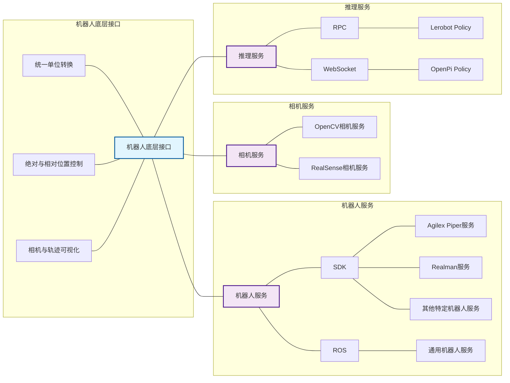
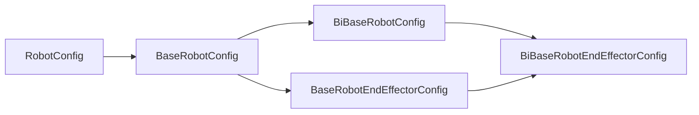
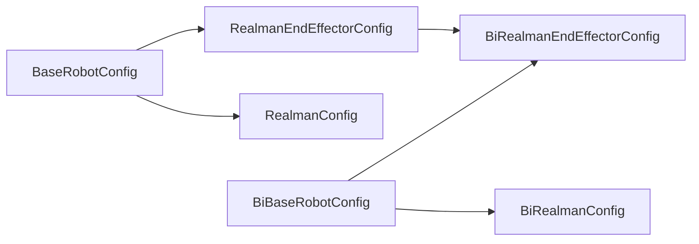
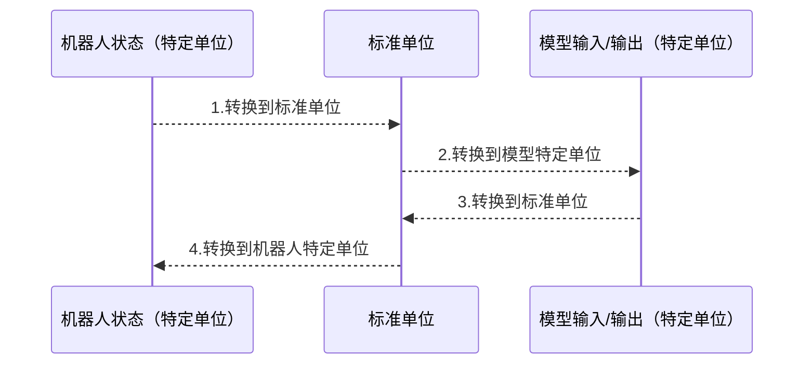
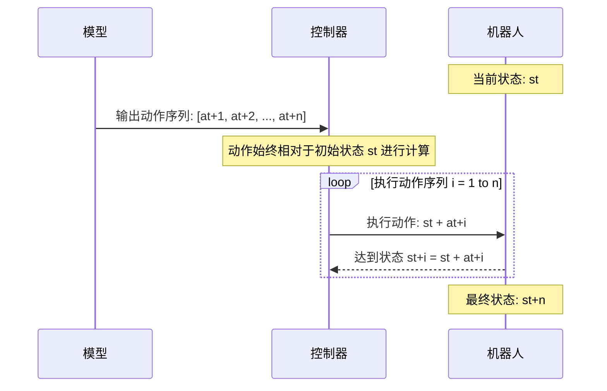

# RoboCoin-LeRobot

[English](README.md) | [中文](README_zh-CN.md) | [LeRobot Readme](README_lerobot.md)

目录
- [概述](#概述)
- [安装](#安装)
- [机器人控制逻辑](#机器人控制逻辑)
    - [机器人目录结构](#机器人目录结构)
    - [机器人基础配置类](#机器人基础配置类)
    - [特定机器人配置类](#特定机器人配置类)
    - [特定功能说明](#特定功能说明)
        - [统一单位转换](#统一单位转换)
        - [绝对与相对位置控制](#绝对与相对位置控制)
- [使用说明](#使用说明)
    - [轨迹重播](#轨迹重播)
    - [模型推理](#模型推理)
        - [基于LeRobot Policy的推理](#基于lerobot-policy的推理)
        - [基于OpenPI Policy的推理](#基于openpi-policy的推理)
        - [层次化任务描述的推理 (目前仅支持OpenPI)](#层次化任务描述的推理-目前仅支持openpi)
- [自定义功能](#自定义功能)
    - [新增自定义机器人](#新增自定义机器人)
- [致谢](#致谢)

## 概述

RoboCoin-LeRobot是一个基于LeRobot扩展的机器人部署环境，旨在为多种机器人平台提供统一的控制接口，实现机器人控制的标准化与简化

**核心功能**：
1. 实现统一机器人控制接口，支持多种机器人平台的接入与控制，如Piper/Realman等基于SDK的控制，以及基于ROS/Moveit的通用控制方式
2. 实现统一单位转换接口，支持多种机器人平台的单位转换，如角度制与弧度制的转换
3. 提供可视化功能，支持2D/3D轨迹绘制与相机图像显示
4. 支持基于LeRobot Policy与OpenPI Policy的模型推理与机器人控制



## 安装

```bash
pip install -e .
```

## 机器人控制逻辑

### 机器人目录结构

所有机器人脚本都在`src/lerobot/robots`下，以Realman机器人平台为例，相应的所有文件位于`src/lerobot/robots/realman`（单臂）与`src/lerobot/robots/bi_realman`（双臂）下:

```bash
realman # 单臂
├── __init__.py
├── configuration_realman.py # 配置类
├── realman.py               # 关节控制
└── realman_end_effector.py  # 末端控制

bi_realman # 双臂
├── __init__.py
├── bi_realman.py               # 关节控制
├── bi_realman_end_effector.py  # 末端控制
└── configuration_bi_realman.py # 配置类
```

### 机器人基础配置类

**继承关系**：


机器人平台的基础配置位于`src/lerobot/robots/base_robot/configuration_base_robot.py`：

```python
# 关节控制的基础配置类
@RobotConfig.register_subclass("base_robot")
@dataclass
class BaseRobotConfig(RobotConfig):
    # 相机设置，表示为字典，字典key为相机名，value为相机配置类，如
    # {
    #     head: {type: opencv, index_or_path:0, height: 480, width: 640, fps: 30}, 
    #     wrist: {type: opencv, index_or_path:1, height: 480, width: 640, fps: 30},
    # }
    # 上述示例创建了head和wrist两个相机，分别加载了/dev/video0, /dev/video1
    # 最终发送给模型的将是{"observation.head": shape(480, 640, 3), "observation.wrist": shape(480, 640, 3)}
    cameras: dict[str, CameraConfig] = field(default_factory=dict)
    # 关节名称，包含夹爪
    joint_names: list[str] = field(default_factory=lambda: [
        'joint_1', 'joint_2', 'joint_3', 'joint_4', 'joint_5', 'joint_6', 'joint_7', 'gripper',
    ]) 

    # 初始化模式：none表示不进行初始化，joint/end_effector表示基于关节/末端初始化
    init_type: str = 'none'
    # 根据初始化模式，在开始推理之前要初始化的值
    # 对于joint，单位为radian
    # 对于end_effector，单位为m(前3个值) / radian（3~6个值）
    init_state: list[float] = field(default_factory=lambda: [
        0, 0, 0, 0, 0, 0, 0, 0,
    ])

    # 各关节控制单位，视SDK而定，如Realman SDK共7个关节，接收角度作为参数，则应设为：
    # ['degree', 'degree', 'degree', 'degree', 'degree', 'degree', 'degree', 'm']
    # 最后一维为m，表示夹爪值不用进行单位转换
    joint_units: list[str] = field(default_factory=lambda: [
        'radian', 'radian', 'radian', 'radian', 'radian', 'radian', 'radian', 'm',
    ])
    # 末端控制单位，视SDK而定，如Realman SDK接收米作为xyz和角度作为rpy，则应设为：
    # ['m', 'm', 'm', 'degree', 'degree', 'degree', 'm']
    # 最后一维为m，表示夹爪值不用进行单位转换
    pose_units: list[str] = field(default_factory=lambda: [
        'm', 'm', 'm', 'radian', 'radian', 'radian', 'm',
    ])
    # 模型接收的关节控制单位，视数据集而定，如数据集中保存的单位为弧度，则应设为：
    # ['radian', 'radian', 'radian', 'radian', 'radian', 'radian', 'radian', 'm']
    # 最后一维为m，表示夹爪值不用进行单位转换
    model_joint_units: list[str] = field(default_factory=lambda: [
        'radian', 'radian', 'radian', 'radian', 'radian', 'radian', 'radian', 'm',
    ])
    
    # 相对位置控制模式：none表示绝对位置控制，previous/init表示基于上一状态或初始状态进行相对转换
    # 以关节控制为例:
    # - 若为previous：则得到的state + 上一个state -> 要达到的state
    # - 若为init：则得到的state + 初始state -> 要达到的state
    delta_with: str = 'none'

    # 是否启用可视化
    visualize: bool = True
    # 是否绘制2D轨迹图，包含XY, XZ, YZ平面上的末端轨迹
    draw_2d: bool = True
    # 是否绘制3D轨迹图
    draw_3d: bool = True


# 末端控制的基础配置类
@RobotConfig.register_subclass("base_robot_end_effector")
@dataclass
class BaseRobotEndEffectorConfig(BaseRobotConfig):
    # 相对变换角，适用于跨本体的情况，即不同本体的零姿态具有不同的朝向，则需要通过该参数进行变换
    base_euler: list[float] = field(default_factory=lambda: [0.0, 0.0, 0.0])

    # 模型接收的末端控制单位，视数据集而定，如数据集中保存的单位是米和弧度，则应设为：
    # ['m', 'm', 'm', 'radian', 'radian', 'radian', 'm']
    # 最后一维为m，表示夹爪值不用进行单位转换
    model_pose_units: list[str] = field(default_factory=lambda: [
        'm', 'm', 'm', 'radian', 'radian', 'radian', 'm',
    ])
```

参数详解：

| 参数名 | 类型 | 默认值 | 说明 |
|--------|------|--------|------|
| `cameras` | `dict[str, CameraConfig]` | `{}` | 相机配置字典，键为相机名称，值为相机配置 |
| `joint_names` | `List[str]` | `['joint_1', 'joint_2', 'joint_3', 'joint_4', 'joint_5', 'joint_6', 'joint_7', 'gripper']` | 关节名称列表，包括夹爪 |
| `init_type` | `str` | `'none'` | 初始化类型，可选：`'none'`, `'joint'`, `'end_effector'` |
| `init_state` | `List[float]` | `[0, 0, 0, 0, 0, 0, 0, 0]` | 初始状态：`init_type='joint'`时为关节状态，`init_type='end_effector'`时为末端执行器状态 |
| `joint_units` | `List[str]` | `['radian', 'radian', 'radian', 'radian', 'radian', 'radian', 'radian', 'm']` | 机器人关节单位，用于SDK控制 |
| `pose_units` | `List[str]` | `['m', 'm', 'm', 'radian', 'radian', 'radian', 'm']` | 末端执行器位姿单位，用于SDK控制 |
| `model_joint_units` | `List[str]` | `['radian', 'radian', 'radian', 'radian', 'radian', 'radian', 'radian', 'm']` | 模型关节单位，用于模型输入/输出 |
| `delta_with` | `str` | `'none'` | 增量控制模式：`'none'`(绝对控制), `'previous'`(相对上一状态), `'initial'`(相对初始状态) |
| `visualize` | `bool` | `True` | 是否启用可视化 |
| `draw_2d` | `bool` | `True` | 是否绘制2D轨迹 |
| `draw_3d` | `bool` | `True` | 是否绘制3D轨迹 |

双臂机器人的基础配置类位于`src/lerobot/robots/base_robot/configuration_bi_base_robot.py`，继承自单臂基础配置类：

```python
# 双臂机器人配置
@RobotConfig.register_subclass("bi_base_robot")
@dataclass
class BiBaseRobotConfig(BaseRobotConfig):
    # 左臂初始姿态
    init_state_left: List[float] = field(default_factory=lambda: [
        0, 0, 0, 0, 0, 0, 0, 0,
    ])
    # 右臂初始姿态
    init_state_right: List[float] = field(default_factory=lambda: [
        0, 0, 0, 0, 0, 0, 0, 0,
    ])


# 双臂机器人末端配置
@RobotConfig.register_subclass("bi_base_robot_end_effector")
@dataclass
class BiBaseRobotEndEffectorConfig(BiBaseRobotConfig, BaseRobotEndEffectorConfig):
    pass
```

参数详解：

| 参数名 | 类型 | 默认值 | 说明 |
|--------|------|--------|------|
| `init_state_left` | `List[float]` | `[0, 0, 0, 0, 0, 0, 0, 0]` | 左臂初始关节状态 |
| `init_state_right` | `List[float]` | `[0, 0, 0, 0, 0, 0, 0, 0]` | 右臂初始关节状态 |

### 特定机器人配置类

每个特定机器人都有专门配置，继承机器人基础配置，请根据具体的机器人SDK进行配置

继承关系，以Realman为例：


以Realman为例，位于`src/lerobot/robots/realman/configuration_realman.py`：

```python
@RobotConfig.register_subclass("realman")
@dataclass
class RealmanConfig(BaseRobotConfig):
    ip: str = "169.254.128.18" # Realman SDK连接ip
    port: int = 8080           # Realman SDK连接端口
    block: bool = False        # 是否阻塞控制
    wait_second: float = 0.1   # 如果非阻塞，每次行动后延迟多久
    velocity: int = 30         # 移动速度

    # Realman共有7个关节 + 夹爪
    joint_names: list[str] = field(default_factory=lambda: [
        'joint_1', 'joint_2', 'joint_3', 'joint_4', 'joint_5', 'joint_6', 'joint_7', 'gripper',
    ])

    # 使用joint控制达到Realman执行任务的初始姿态
    init_type: str = "joint"
    init_state: list[float] = field(default_factory=lambda: [
        -0.84, -2.03,  1.15,  1.15,  2.71,  1.60, -2.99, 888.00,
    ])

    # Realman SDK默认采用米 + 角度
    joint_units: list[str] = field(default_factory=lambda: [
        'degree', 'degree', 'degree', 'degree', 'degree', 'degree', 'degree', 'm',
    ])
    pose_units: list[str] = field(default_factory=lambda: [
        'm', 'm', 'm', 'degree', 'degree', 'degree', 'm',
    ])


@RobotConfig.register_subclass("realman_end_effector")
@dataclass
class RealmanEndEffectorConfig(RealmanConfig, BaseRobotEndEffectorConfig):
    pass
```

对于双臂Realman，配置类位于`src/lerobot/robots/bi_realman/configuration_bi_realman.py`：

```python
# 双臂Realman配置
@RobotConfig.register_subclass("bi_realman")
@dataclass
class BiRealmanConfig(BiBaseRobotConfig):
    ip_left: str = "169.254.128.18" # Realman左臂SDK连接ip
    port_left: int = 8080 # Realman左臂SDK连接端口
    ip_right: str = "169.254.128.19" # Realman右臂SDK连接ip
    port_right: int = 8080 # Realman右臂SDK连接端口
    block: bool = False # 是否阻塞控制
    wait_second: float = 0.1 # 如果非阻塞，每次行动后延迟多久
    velocity: int = 30 # 移动速度
    
    # Realman共有7个关节 + 夹爪
    joint_names: List[str] = field(default_factory=lambda: [
        'joint_1', 'joint_2', 'joint_3', 'joint_4', 'joint_5', 'joint_6', 'joint_7', 'gripper',
    ])
    
    # 使用joint控制达到Realman执行任务的初始姿态
    init_type: str = "joint"
    init_state_left: List[float] = field(default_factory=lambda: [
        -0.84, -2.03,  1.15,  1.15,  2.71,  1.60, -2.99, 888.00,
    ])
    init_state_right: List[float] = field(default_factory=lambda: [
         1.16,  2.01, -0.79, -0.68, -2.84, -1.61,  2.37, 832.00,
    ])

    # Realman SDK默认采用米 + 角度
    joint_units: List[str] = field(default_factory=lambda: [
        'degree', 'degree', 'degree', 'degree', 'degree', 'degree', 'degree', 'm',
    ])
    pose_units: List[str] = field(default_factory=lambda: [
        'm', 'm', 'm', 'degree', 'degree', 'degree', 'm',
    ])


# 双臂Realman末端执行器配置
@RobotConfig.register_subclass("bi_realman_end_effector")
@dataclass
class BiRealmanEndEffectorConfig(BiRealmanConfig, BiBaseRobotEndEffectorConfig):
    pass
```

### 特定功能说明

#### 统一单位转换

该模块位于`src/lerobot/robots/base_robot/units_transform.py`，提供长度和角度测量的单位转换功能，支持在机器人控制系统中进行统一的单位管理：长度使用米（m），角度使用弧度（rad）

**长度单位转换**：标准单位为米（m），支持微米、毫米、厘米、米之间的转换

| 单位 | 符号 | 换算关系 | 
|-----|------|----------|
| 微米 | 001mm   | 1 um = 1e-6 m |
| 毫米 | mm   | 1 mm = 1e-3 m |
| 厘米 | cm   | 1 cm = 1e-2 m |
| 米   | m    | 1 m = 1 m |

**角度单位转换**：标准单位为弧度（rad），支持毫度、度和弧度之间的转换

| 单位 | 符号 | 换算关系 |
|-----|------|----------|
| 毫度 | 001deg | 1(001deg) = π/18000 rad |
| 度   | deg  | 1 deg = π/180 rad |
| 弧度 | rad  | 1 rad = 1 rad |

推理过程中，机器人平台的控制单位与模型输入/输出单位可能不同，该模块提供了统一的转换接口，确保在控制过程中单位的一致性与正确性：
1. 机器人状态到模型输入的转换：机器人特定单位 -> 标准单位 -> 模型特定单位
2. 模型输出到机器人控制的转换：模型特定单位 -> 标准单位 -> 机器人特定单位



#### 绝对与相对位置控制

提供绝对与相对（相对上一状态、相对初始状态）位置控制3种模式，适用于关节控制与末端执行器控制：
1. 绝对位置控制（absolute）：直接使用模型输出的位置作为目标位置
2. 相对上一状态位置控制（relative to previous）：将模型输出的位置作为相对于上一个状态的增量，计算目标位置
   - 不使用action chunking: 动作 = 当前状态 + 模型输出
   - 使用action chunking: 动作 = 当前状态 + 模型输出的所有chunk，全部执行结束后再更新当前状态
3. 相对初始状态位置控制（relative to initial）：将模型输出的位置作为相对于初始状态的增量，计算目标位置

基于相对上一状态位置控制时，使用action chunking的控制流程示例：



## 使用说明

### 轨迹重播

机器人平台的配置选项可以在配置类文件中修改，也可以通过命令行传入，以双臂Realman为例，命令如下：

```bash
python src/lerobot/scripts/replay.py \
    --repo_id=<your_lerobot_repo_id> \
    --robot.type=bi_realman \
    --robot.ip_left="169.254.128.18" \
    --robot.port_left=8080 \
    --robot.ip_right="169.254.128.19" \
    --robot.port_right=8080 \
    --robot.block=True \
    --robot.cameras="{ observation.images.cam_high: {type: opencv, index_or_path: 8, width: 640, height: 480, fps: 30}, observation.images.cam_left_wrist: {type: opencv, index_or_path: 20, width: 640, height: 480, fps: 30},observation.images.cam_right_wrist: {type: opencv, index_or_path: 14, width: 640, height: 480, fps: 30}}" \
    --robot.id=black \
    --robot.visualize=True
```

上述命令指定了Realman左臂与右臂的IP/端口，并加载了头部、左手、右手相机，轨迹重播时将根据`<your_lerobot_repo_id>`中的数据进行控制

### 模型推理

#### 基于LeRobot Policy的推理

1. 运行LeRobot Server，详见`src/lerobot/scripts/server/policy_server.py`，命令如下：
```bash
python src/lerobot/scripts/server/policy_server.py \
    --host=127.0.0.1 \
    --port=18080 \
    --fps=10 
```
上述命令将启动一个监听在`127.0.0.1:18080`的服务

2. 运行客户端程序，以双臂Realman为例，命令如下：
```bash
python src/lerobot/scripts/server/robot_client.py \
    --robot.type=bi_realman \
    --robot.ip_left="169.254.128.18" \
    --robot.port_left=8080 \
    --robot.ip_right="169.254.128.19" \
    --robot.port_right=8080 \
    --robot.cameras="{ front: {type: opencv, index_or_path: 8, width: 640, height: 480, fps: 30}, left_wrist: {type: opencv, index_or_path: 14, width: 640, height: 480, fps: 30},right_wrist: {type: opencv, index_or_path: 20, width: 640, height: 480, fps: 30}}" \
    --robot.block=False \
    --robot.id=black \
    --fps=10 \
    --task="do something" \
    --server_address=127.0.0.1:8080 \
    --policy_type=act \
    --pretrained_name_or_path=path/to/checkpoint \
    --actions_per_chunk=50 \
    --verify_robot_cameras=False
```
上述命令将初始化realman姿态，加载头部、左手、右手相机，传入"do something"作为prompt，加载ACT模型进行推理，并获取action对机器人平台进行控制

#### 基于OpenPI Policy的推理

1. 运行OpenPI Server，详见[OpenPI官方仓库](https://github.com/Physical-Intelligence/openpi)

2. 运行客户端程序，以Realman为例，命令如下：

```bash
python src/lerobot/scripts/server/robot_client_openpi.py \
  --host="127.0.0.1" \ # 服务端IP
  --port=8000 \ # 服务端端口号
  --task="put peach into basket" \ # 任务指令
  --robot.type=bi_realman \ # Realman的配置项
  --robot.ip_left="169.254.128.18" \ 
  --robot.port_left=8080 \ 
  --robot.ip_right="169.254.128.19" \ 
  --robot.port_right=8080 \ 
  --robot.block=False \ 
  --robot.cameras="{ observation.images.cam_high: {type: opencv, index_or_path: 8, width: 640, height: 480, fps: 30}, observation.images.cam_left_wrist: {type: opencv, index_or_path: 14, width: 640, height: 480, fps: 30},observation.images.cam_right_wrist: {type: opencv, index_or_path: 20, width: 640, height: 480, fps: 30}}" \ # 
  --robot.init_type="joint" \
  --robot.id=black
```

上述命令将初始化realman姿态，加载头部、左手、右手相机，传入"put peach into basket"作为prompt，并获取action对机器人平台进行控制。

推理时，可以在控制台中按"q"随时退出，之后按"y/n"表示当前任务成功或失败，视频将被存放到`results/`目录中。

#### 层次化任务描述的推理 (目前仅支持OpenPI)

首先为当前任务编写一个配置类，如`src/lerobot/scripts/server/task_configs/towel_basket.py`:

```python
@dataclass
class TaskConfig:
    # 场景描述
    scene: str = "a yellow basket and a grey towel are place on a white table, the basket is on the left and the towel is on the right."
    # 任务指令
    task: str = "put the towel into the basket."
    # 子任务指令
    subtasks: List[str] = field(default_factory=lambda: [
        "left gripper catch basket",
        "left gripper move basket to center",
        "right gripper catch towel",
        "right gripper move towel over basket and release",
        "end",
    ])
    # 状态统计算子
    operaters: List[Dict] = field(default_factory=lambda: [
        {
            'type': 'position',
            'name': 'position_left',
            'window_size': 1,
            'state_key': 'observation.state',
            'xyz_range': (0, 3),
        }, {
            'type': 'position',
            'name': 'position_right',
            'window_size': 1,
            'state_key': 'observation.state',
            'xyz_range': (7, 10),
        }, {
            'type': 'position_rotation',
            'name': 'position_aligned_left',
            'window_size': 1,
            'position_key': 'position_left',
            'rotation_euler': (0, 0, 0.5 * math.pi),
        }, {
            'type': 'position_rotation',
            'name': 'position_aligned_right',
            'window_size': 1,
            'position_key': 'position_right',
            'rotation_euler': (0, 0, 0.5 * math.pi),
        }, {
            'type': 'movement',
            'name': 'movement_left',
            'window_size': 3,
            'position_key': 'position_aligned_left',
        }, {
            'type': 'movement',
            'name': 'movement_right',
            'window_size': 3,
            'position_key': 'position_aligned_right',
        },{
            'type': 'movement_summary',
            'name': 'movement_summary_left',
            'movement_key': 'movement_left',
            'threshold': 2e-3,
        }, {
            'type': 'movement_summary',
            'name': 'movement_summary_right',
            'movement_key': 'movement_right',
            'threshold': 2e-3,
        }, 
    ])
```

之后运行命令：

```bash
python src/lerobot/scripts/server/robot_client_openpi_anno.py \
  --host="127.0.0.1" \
  --port=8000 \
  --task_config_path="lerobot/scripts/server/task_configs/towel_basket.py" \
  --robot.type=bi_realman_end_effector \
  --robot.ip_left="169.254.128.18" \
  --robot.port_left=8080 \
  --robot.ip_right="169.254.128.19" \
  --robot.port_right=8080 \
  --robot.block=False \
  --robot.cameras="{ observation.images.cam_high: {type: opencv, index_or_path: 8, width: 640, height: 480, fps: 30}, observation.images.cam_left_wrist: {type: opencv, index_or_path: 14, width: 640, height: 480, fps: 30},observation.images.cam_right_wrist: {type: opencv, index_or_path: 20, width: 640, height: 480, fps: 30}}" \
  --robot.init_type="joint" \
  --robot.id=black
```

推理时，将从第一个子任务开始，按"s"切换到下一个子任务。
可以在控制台中按"q"随时退出，之后按"y/n"表示当前任务成功或失败，视频将被存放到`results/`目录中。

## 自定义功能

### 新增自定义机器人

1. 在`src/lerobot/robots/`目录下创建一个新的文件夹，命名为你的机器人名称，如`my_robot`
2. 在该文件夹下创建以下文件：
   - `__init__.py`：初始化文件
   - `my_robot.py`：实现机器人控制逻辑
   - `configuration_my_robot.py`：定义机器人配置类，继承自`RobotConfig`
3. 在`configuration_my_robot.py`中定义机器人配置，包括SDK特定配置与所需的基础配置参数
4. 在`my_robot.py`中实现机器人控制逻辑，继承自`BaseRobot`
5. 实现所有抽象方法：
   - `_check_dependencys(self)`: 检查机器人所需的依赖项
   - `_connect_arm(self)`: 连接到机器人
   - `_disconnect_arm(self)`: 断开与机器人的连接
   - `_set_joint_state(self, joint_state: np.ndarray)`: 设置机器人的关节状态，输入为关节状态的numpy数组，单位为配置类中定义的`joint_units`
   - `_get_joint_state(self) -> np.ndarray`: 获取机器人的当前关节状态，返回值为关节状态的numpy数组，单位为配置类中定义的`joint_units`
   - `_set_ee_state(self, ee_state: np.ndarray)`: 设置机器人的末端执行器状态，输入为末端执行器状态的numpy数组，单位为配置类中定义的`pose_units`
   - `_get_ee_state(self) -> np.ndarray`: 获取机器人的当前末端执行器状态，返回值为末端执行器状态的numpy数组，单位为配置类中定义的`pose_units`
6. 参照其他机器人实现类，实现其他控制方式（可选）：
   - `my_robot_end_effector.py`：实现基于末端执行器的控制逻辑，继承自`BaseRobotEndEffector`与`my_robot.py`
   - `bi_my_robot.py`：实现双臂机器人的控制逻辑，继承自`BiBaseRobot`与`my_robot.py`
   - `bi_my_robot_end_effector.py`：实现双臂机器人基于末端执行器的控制逻辑，继承自`BiBaseRobotEndEffector`与`my_robot_end_effector.py`
7. 在`src/lerobot/robots/utils.py`中注册你的机器人配置类：
   ```python
   elif robot_type == "my_robot":
       from .my_robot.configuration_my_robot import MyRobotConfig
       return MyRobotConfig(**config_dict)
   elif robot_type == "my_robot_end_effector":
       from .my_robot.configuration_my_robot import MyRobotEndEffectorConfig
       return MyRobotEndEffectorConfig(**config_dict)
   elif robot_type == "bi_my_robot":
       from .my_robot.configuration_my_robot import BiMyRobotConfig
       return BiMyRobotConfig(**config_dict)
   elif robot_type == "bi_my_robot_end_effector":
       from .my_robot.configuration_my_robot import BiMyRobotEndEffectorConfig
       return BiMyRobotEndEffectorConfig(**config_dict)
   ```
8. 在推理脚本开头导入你的机器人实现类：
   ```python
   from lerobot.robots.my_robot.my_robot import MyRobot
   from lerobot.robots.my_robot.my_robot_end_effector import MyRobotEndEffector
   from lerobot.robots.my_robot.bi_my_robot import BiMyRobot
   from lerobot.robots.my_robot.bi_my_robot_end_effector import BiMyRobotEndEffector
   ```
9. 现在你可以通过命令行参数`--robot.type=my_robot`来使用你的自定义机器人了

## 致谢

感谢以下开源项目对RoboCoin-LeRobot的支持与帮助：
- [LeRobot](https://github.com/huggingface/lerobot)
- [OpenPI](https://github.com/Physical-Intelligence/openpi)